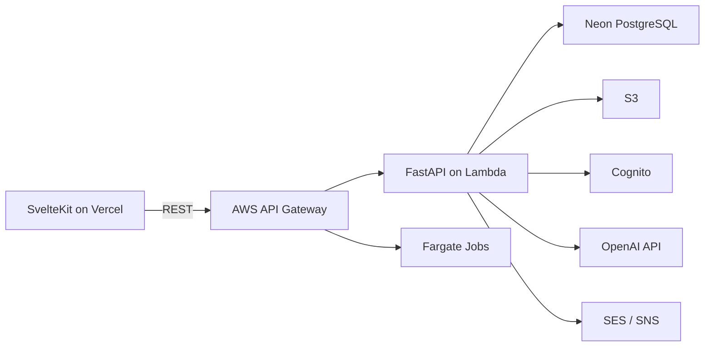

# Sister 2


> Serverless-first なWork管理・社内業務基盤  
> SvelteKit + FastAPI + AWS + Neon + AI

## 📘 概要

Sister 2 は、既存のプロジェクト進捗管理システム「Sister」を、
**Work（仕事）中心モデル**で再設計した次世代版です。

- Work管理（開発/運用/保守/突発対応を同一のWorkとして扱う）
- Work単位のチャット
- 定義駆動型の社内ツール（フォーム / ワークフロー / 集計）
- AIによる要約・補助（人の判断を置き換えない設計）

を、運用負荷を最小化したモダンアーキテクチャで提供します。

## 🎯 コンセプト

- Serverless-first
- Low Cost / Low Ops
- 段階的拡張（PoC → 本実装）
- AIは補助役（Human-in-the-loop）

「全部自動化」ではなく、
人の作業・判断を楽にするための基盤を目指します。

## 🧩 主な機能

### コア機能

- Work管理（CRUD / ステータス / タグ）
- Work担当（主担当 + 参加者）
- Work対象管理（プロジェクト / システム / 共通業務）
- ファイル管理（S3署名URL）
- 通知（SES / SNS）

### チャット機能

- Work単位のスレッド
- HTTPベースの擬似リアルタイム（初期）
- 将来的に SSE / WebSocket へ移行可能

### 社内ツール（定義駆動型）

- Excel管理業務の置き換え
- フォーム / ワークフロー / 集計 の3タイプに抽象化
- 定義JSONによる柔軟な拡張
- 2段階承認フロー対応

### AI連携（補助的）

- Work / チャット / ナレッジの要約
- 入力補助・内容チェック
- レポート生成（バッチ / オンデマンド）

## 🏗 アーキテクチャ概要



- Lambda: 即時レスポンスが必要なAPI
- Fargate: 長時間処理・AI・バッチ

## 🛠 技術スタック

### Frontend

- SvelteKit
- TypeScript
- Tailwind CSS / shadcn-svelte
- Vercel

### Backend

- FastAPI
- AWS Lambda / Fargate
- AWS API Gateway

### Infrastructure

- Neon (PostgreSQL)
- AWS S3
- AWS Cognito
- AWS SES / SNS
- CloudWatch

### CI/CD & IaC

- GitHub Actions
- Serverless Framework

### AI

- OpenAI API（要約・提案）

## 📂 リポジトリ構成（予定）

```
/
├─ frontend/        # SvelteKit
├─ backend/         # FastAPI (Lambda)
│  └─ serverless.yml   # IaC (Serverless Framework)
├─ jobs/            # Fargate batch jobs
├─ db/              # schema / migrations
├─ .github/         # GitHub Actions
├─ docs/            # 設計・仕様ドキュメント
└─ README.md
```

## 📄 ドキュメント

- requirements.md — 要件定義
- architecture.md — アーキテクチャ設計
- api_spec.md — API仕様
- er_diagram.mmd — ER図
- poc_plan.md — PoC計画
- poc_dev_env_setup.md — PoC開発環境構築手順

## 🚧 ステータス

- 現在: 設計 / PoCフェーズ
- 実装は PoC 完了後に段階的に進行予定

## ⚠️ 注意事項

- 本リポジトリは 個人開発 / PoC 前提
- 仕様は今後変更される可能性があります
- AI連携は補助目的であり、判断・承認は人が行います

## 📝 ライセンス

MIT
