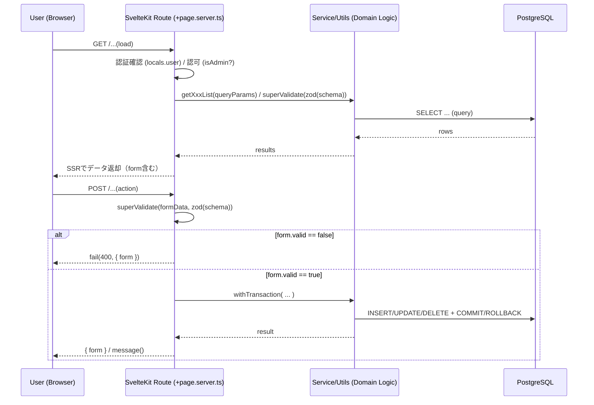
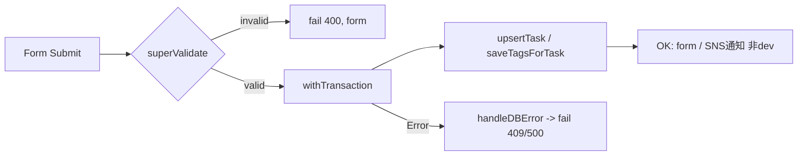
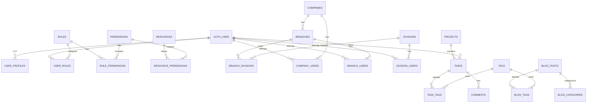
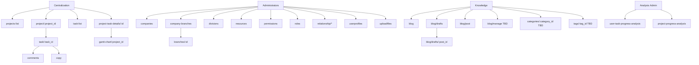

# SISTER プロジェクト — 全体アーキテクチャ設計書（STEP1）
最終更新: 2025-10-29（JST）

本書は、`sister/web`（SvelteKit）と `sister/db`（PostgreSQL）を中核とした**業務管理・中央集約・RBAC・ブログ**機能群の**全体像**を日本語で整理したものです。コード断片から確認できた構造と、保守性/安全性/拡張性の観点での**標準化指針**・**改善提案**を併記します。

---

## 1. アーキテクチャの基本方針
- **3層構造**（Routes/Actions ←→ Services ←→ DB/Repositories）
- **認証/認可の二段構え**：
  - 認証（`locals.user`）：未ログインは `throwError401()`
  - 認可（RBAC / Resource-Permission）：管理画面等では `isAdmin()` を利用
- **トランザクション集約**：DB更新は必ず `withTransaction()` 経由
- **入力検証の均一化**：`sveltekit-superforms` + `zod` スキーマ（サーバ側で `superValidate`）
- **エラー処理の統一**：DBエラーコード（例: 23505）をハンドリングし、`fail(status, { form })` で返却
- **型安全**：`query-params.ts` / `query-results.ts` による入出力契約の明示
- **通知/外部連携**：SNS通知（`snsNotify`）・S3 署名URL（アバターアップロード）

> ねらい：**均一な実装パターン**を徹底し、障害時の切り分けと将来の機能追加を高速化。

---

## 2. リクエスト・ライフサイクル（概観）



---

## 3. ディレクトリ／レイヤ責務（要点）

- **Routes**: `+page.server.ts` がロード/アクションの窓口。認証・認可・入力検証・サービス呼び出し・レスポンス整形を担当。
- **Services/Utils**: ビジネスルール、複合クエリ、タグ付与保存、SNS通知、S3署名URL生成、一覧取得などを集約。
  - 例）`getTaskList`, `getProjectList`, `getProjectTaskTagList`, `getUserInfo`, `snsNotify`, `getSignedUrls`
- **DB 層**: `query`, `withTransaction` を経由して SQL を実行。**INSERT/UPDATE/DELETE** は**必ず**トランザクション化。

> **提案**：`$lib/server/repositories/*` としてクエリ断片をリポジトリに寄せ、Routes/Services からの生 SQL を減らす。

---

## 4. 認証/認可フロー（AuthN/AuthZ）

### 4.1 認証（AuthN）
- `locals.user?.id` によりログイン済みを判定、未ログインは `throwError401()`。
- 管理メニューはさらに `isAdmin(userId)` を通過する必要あり。

### 4.2 認可（AuthZ / RBAC）
- 管理者判定の他、**Resource / Permission / Action** の組で細粒度制御。
- 関連UI:
  - リソース管理: `/administrators/resources`
  - パーミッション管理: `/administrators/permissions`
  - 役割管理: `/administrators/roles`
  - 関係付け: `role-permissions`, `resource-permissions`, `user-roles`, `company-users`, `branch-users`, `division-users`

#### 推奨ミドルウェア API（擬コード）
```ts
// $lib/server/authz.ts
export async function authorize(userId: string, resourceId: string, action: 'read'|'create'|'update'|'delete') {
  // isAdmin → pass
  // else → user_roles → role_permissions → resource_permissions の交差で判定
}
```

---

## 5. 中央集約（プロジェクト/タスク）モジュール

### 5.1 代表ルート
- **プロジェクト詳細**: `/centralization/project/[project_id]`
- **タスク詳細/編集**: `/centralization/project/[project_id]/task/[task_id]`
- **タスクコメント**: `/centralization/project/[project_id]/task/[task_id]/comments`
- **タスク複製**: `/centralization/project/[project_id]/task/[task_id]/copy`
- **ガント**: `/centralization/project-task-details/[id]/gantt-chart/[project_id]`
- **一覧**: `/centralization/task-list`, `/centralization/projects-list`

### 5.2 入出力の型（例）
- `query-params.ts` / `query-results.ts` で **検索条件** と **結果** を型定義。    
- 例：`TaskListQueryParams`, `TaskListResult`, `ProjectsListQueryParams`, `ProjectsListResult`

### 5.3 典型的アクション・フロー
- `superValidate(formData, zod(schema))`
- `withTransaction(async (client) => upsert/update/insert/delete)`
- タグ更新は**一括削除→一括INSERT**（`task_tags`）



---

## 6. Blog モジュール（現状と補完方針）

### 6.1 実装済み/抜粋
- Draft 一覧: `/knowledge/blog/drafts`
- Draft 詳細: `/knowledge/blog/drafts/[post_id]`（`updateBlogDraft` で更新）
- 新規投稿: `/knowledge/blog/post`（`insertBlogPost` で登録）
- 補助: `fetchBlogCategories()`

### 6.2 今後の追加（提案）
- `/knowledge/blog/manage`（未実装）：カテゴリ・タグ・公開/下書き切替、検索/並替
- `/knowledge/blog/categories/[category_id]`（未実装）
- `/knowledge/blog/tags/[tag_id]`（未実装）
- 公開閲覧用の**SSG/SSR ルート**（SEO考慮）
- **権限**：編集は投稿者/管理者、公開はエディタ以上などルール化

---

## 7. ファイルアップロード

### 7.1 画像のローカル保存（管理画面）
- ルート: `/administrators/uploadfiles`
- `mySystem.uploadTo.image` に保存（フォルダ存在チェック + `mkdirSync`）

### 7.2 ユーザーアバター S3 署名URL
- ルート: `/administrators/userprofiles`
- 更新 → 署名URL (`getSignedUrls`) 取得 → クライアントから直接 PUT

> **推奨**：大容量に備えた **Content-Length** 制御、MIME 制限、ウイルススキャン（必要に応じ）

---

## 8. 組織・関係管理（Company/Branch/Division/User）

### 8.1 関係付け UI
- `company-users`, `branch-users`, `division-users`
- `company-branch-divisions`: 会社 → 支店 → 部門 の階層付与
- 役割・権限：`user-roles`, `role-permissions`, `resource-permissions`

### 8.2 代表的なクエリパターン
- 「対象テーブル」 LEFT JOIN 「中間テーブル（選択行のみ）」 → `CASE WHEN ... THEN 1 END AS checked` → `boolean` へ変換

---

## 9. エラー処理・トランザクション・バリデーションの標準

### 9.1 `handleDBError` の共通化
- 現状：各ファイルで重複定義（`23505` 等）
- **提案**：`$lib/server/errors.ts` に集約し、`DBErrorMap` を定義

```ts
// $lib/server/errors.ts
export function handleDBError(error: unknown, form: any) {
  if (error instanceof Error) {
    const code = (error as any).code;
    if (code === '23505') return fail(409, { form: { ...form, message: 'Data conflict occurred.' } });
    if (code === '23514') return fail(403, { form: { ...form, message: 'Check constraint violated.' } });
  }
  return fail(500, { form: { ...form, message: 'An unknown error occurred.' } });
}
```

### 9.2 トランザクション指針
- **原則**：**複数テーブル**を跨ぐ更新は必ず `withTransaction`
- **タグ再登録**のような**削除→挿入**の整合性もトランザクションで担保

### 9.3 バリデーション
- **サーバ**：`superValidate(zod(schema))`
- **クライアント**：必要に応じて `zod` で補助（ユーザー体験向上）

---

## 10. データモデル（ER 図 / 抜粋）

> 実テーブル名は推定を含みます。中間テーブルの形はコードから読み取れる範囲で明示。



### 10.1 インデックス/制約の推奨
- `UNIQUE`: `branches(company_id, branch_code)`（実装済）
- `FK`: 参照整合性（ON DELETE CASCADE/RESTRICT の設計方針を明記）
- `INDEX`: 検索頻度の高い列（`project_id`, `user_id`, 日付レンジ）に複合 Index
- `CHECK`: `permissions.action` は `ENUM` 的に制限（既にチェック制約 23514 のハンドリングあり）

---

## 11. セキュリティ指針（要点）
- **認可抜けの防止**：管理画面は `isAdmin` に加えて**権限単位**での保護を検討
- **ファイルアップロード**：サイズ制限、Content-Type 制限、パス正規化、ウイルススキャン（必要なら）
- **監査**：重要操作は操作ユーザーID・IP・時刻を監査ログへ
- **エラーメッセージ**：機微情報を出さない（コードのみ、文面は一般化）

---

## 12. 観測性/運用
- **ログ**：DBエラーコード + ルート + ユーザーID を構造化ログで出力
- **メトリクス**：一覧クエリ実行時間、トランザクション失敗率、SNS通知失敗率
- **アラート**：一定閾値超過で通知（Slack/Email/SNS）

---

## 13. コーディング規約の提案
- `handleDBError` / `withTransaction` の**共通ユーティリティ**化
- `Result` 型は**nullable最小化**（必要フィールドを `required` に寄せる）
- `query-params.ts` は**日付/数値**の**厳密型**（`toDateOrUndefined`, `toNumberOrUndefined`）の徹底
- `superValidate` の戻り `{ form }` に**標準メッセージキー**（`message`, `errorCode`）を統一

---

## 14. 画面マップ（抜粋）


---

## 15. テスト戦略（要約）
- **ユニット**：Service/Repository の純粋ロジックを切り出して検証
- **結合**：`withTransaction` を含む成功/失敗パス、`23505/23514` をモック
- **E2E**：主要フロー（プロジェクト作成→タスク作成→タグ付→コメント→ガント反映）

---

## 16. 今後の改善タスク（サマリ）
1. `handleDBError` と `authorize()` の**共通化**・導入
2. Repositories 層の**導入**（生 SQL 散在の解消）
3. Blog 管理/公開ルートの**実装完了**（SSG/SSR）
4. RBAC の**画面別 Permission マトリクス**を README/Docs に追記
5. インデックス/外部キー/削除ポリシーの**明文化**（ERDと整合）

---

## 17. 付録：Permission マトリクス（たたき）

| 画面/機能 | Resource | Action | 既定ロール |
|---|---|---|---|
| プロジェクト一覧/詳細 | `projects` | `read` | admin, manager, member |
| プロジェクト登録/更新 | `projects` | `create/update` | admin, manager |
| タスク一覧/詳細 | `tasks` | `read` | admin, manager, member |
| タスク登録/更新/タグ付け | `tasks` | `create/update` | admin, manager, member(自分のタスク) |
| コメント追加 | `comments` | `create` | admin, manager, member |
| RBAC 管理 | `rbac` | `read/update` | admin |
| Blog 投稿作成/編集 | `blog` | `create/update` | admin, editor |
| Blog 公開 | `blog` | `publish` | admin, editor |
| ユーザープロファイル編集 | `userprofiles` | `update` | admin, self |

> ※ 実 DB の `permissions.action` チェック制約（`permissions_action_check`）に合わせて `read/create/update/delete/publish` 等を正規化。

---

### キー・テイクアウェイ
- **パターンの統一**（認証/認可・検証・トランザクション・エラー）が保守コストを劇的に下げる
- RBAC を**画面/操作単位**で明文化し、**authorize ミドルウェア**を導入
- Blog と 中央集約（プロジェクト/タスク/タグ/コメント）を**同一指針**で拡張可能
- Repositories 導入で**責務分離**と**テスト容易性**を向上

