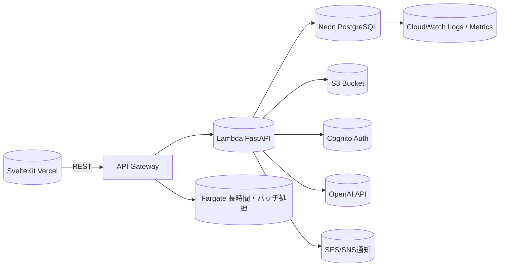
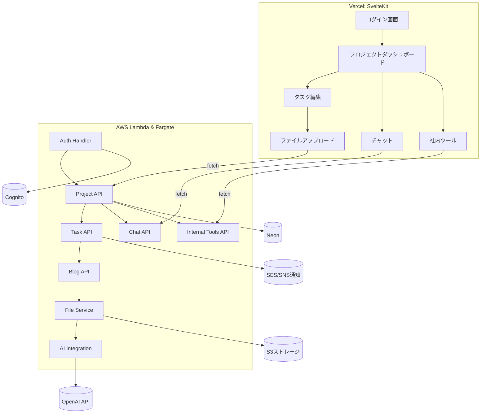
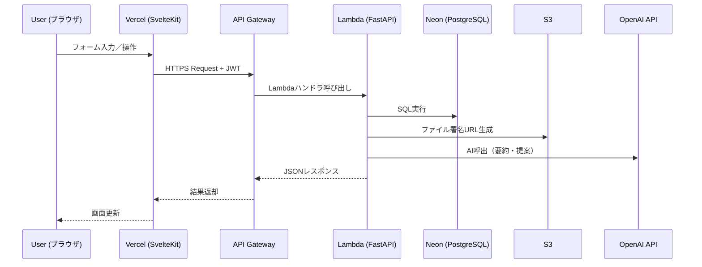

# 🏗 Sister 2 Architecture 設計書（雛形）

---

## 1. ドキュメント概要

| 項目 | 内容 |
|------|------|
| 文書名 | Sister 2 Architecture 設計書 |
| バージョン | 0.1（初版） |
| 作成日 | 2025-10-29 |
| 作成者 | （あなたの氏名またはチーム名） |
| 目的 | Sisterシステムをモダン化するためのアーキテクチャ・設計方針を定義する |

---

## 2. アーキテクチャ原則

- Serverless-first
- Lambdaは短時間のリクエスト/レスポンス処理を担当
- Fargateは長時間・バッチ・AI処理を担当
- 運用負荷を最小化する構成を優先

---

## 3. システム全体構成図



---

## 4. コンポーネント構成

### 構成概要

| レイヤ | サービス | 主な役割 |
|--------|-----------|----------|
| フロントエンド | Vercel (SvelteKit) | UI表示・API連携・JWT保持 |
| APIゲートウェイ | AWS API Gateway | HTTPSエンドポイント公開・CORS・認証制御 |
| バックエンド | AWS Lambda + FastAPI | CRUD処理・認証・AI連携・軽処理 |
| バックエンド（長時間・バッチ処理） | AWS Fargate (Go or Python) | 集計・ファイル変換・定期バッチ |
| データベース | Neon PostgreSQL | サーバレスDB、自動スケール対応 |
| ストレージ | S3 | ファイル・添付・一時共有データ |
| 認証 | Cognito | サインイン／グループ認可／JWT発行 |
| 通知 | SES/SNS/WebPush | メール・リアルタイム通知 |
| AI連携 | OpenAI API | タスク要約・ナレッジ自動生成 |
| モニタリング | CloudWatch / X-Ray | エラー・パフォーマンス監視 |
| IaC | Serverless Framework | AWS構築自動化 |
| CI/CD | GitHub Actions | 自動デプロイ・テスト・Lint |

### コンポーネント構成図（詳細）



---

## 5. データフロー（APIリクエスト例）



---

## 6. ディレクトリ構成（想定）

```plaintext
sister-next/
├─ frontend/            # SvelteKit + TypeScript
│  ├─ src/lib/
│  ├─ src/routes/
│  └─ package.json
│
├─ backend/
│  ├─ api/              # FastAPIエンドポイント群
│  ├─ jobs/             # Fargateジョブ
│  ├─ models/           # Pydanticモデル
│  ├─ services/         # ビジネスロジック層
│  ├─ utils/            # 汎用ユーティリティ
│  └─ serverless.yml    # IaC定義
│
├─ db/
│  ├─ migrations/
│  └─ schema.sql
│
├─ .github/workflows/   # GitHub Actions
├─ docs/                # 提案資料・要件定義・設計書
└─ README.md
```

---

## 7. CI/CD 構成

| 区分 | 処理内容 | 使用ツール |
|------|-----------|-------------|
| フロントエンド | Lint → Build → Deploy | GitHub Actions → Vercel |
| バックエンド | Test → Package → Deploy | GitHub Actions → Serverless Framework |
| IaC | serverless deploy | Serverless Framework |
| テスト | pytest, playwright | 自動実行・結果レポート化 |

---

## 8. セキュリティ設計（概要）

| 項目 | 内容 |
|------|------|
| 認証 | Cognito（Hosted UI + JWT） |
| 認可 | RBAC（roles／permissions） |
| 通信 | 全通信HTTPS、API GatewayでCORS制御 |
| 秘密情報 | AWS Secrets Manager管理（OpenAIキー等） |
| ログ | CloudWatch Logs + DynamoDB監査テーブル |
| 権限管理 | IAM最小権限（Least Privilege原則） |

---

## 9. データベース設計（上位レベル）

| テーブル | 概要 | 備考 |
|-----------|------|------|
| companies / branches / divisions | 組織構造 | 移行対象 |
| users / user_profiles | ユーザー基本情報 | Cognito連携 |
| roles / permissions / resources | RBAC制御 | 既存踏襲 |
| projects / tasks / task_tags | プロジェクト／タスク管理 | コア機能 |
| blog_posts / blog_categories / blog_tags | ナレッジ機能 | AI要約対応 |
| chat_threads / chat_messages | チャット機能 | プロジェクト/タスク単位 |
| internal_tools / tool_forms / tool_workflows | 社内ツール | 定義駆動型 |
| audit_logs | 操作履歴 | 自動記録 |

---

## 10. API設計方針（REST固定）

- APIはRESTで設計する
- GraphQLは将来検討とする
- チャットは初期はHTTPベースで実装し、将来SSE/WebSocketを検討する

---

## 11. 長時間・バッチ処理設計（Fargate）

| 関数名 | 機能 | トリガー | 備考 |
|--------|------|-----------|------|
| auth_handler | JWT検証／Cognito認証 | API Gateway | 共通ミドル |
| project_api | プロジェクトCRUD | API Gateway | FastAPI |
| task_api | タスクCRUD／SNS通知 | API Gateway | |
| chat_api | チャットCRUD | API Gateway | HTTPベース |
| internal_tools_api | 社内ツールCRUD | API Gateway | 定義駆動型 |
| file_upload | S3署名URL発行 | API Gateway | |
| ai_summary | OpenAI要約生成 | Fargate | 長時間・重処理に固定 |
| scheduled_backup | DBバックアップ | CloudWatch Event | |

---

## 12. 監視/運用設計

| 項目 | 内容 |
|------|------|
| 監視対象 | Lambda実行失敗、API Gateway 5xx、Fargate異常終了 |
| 通知先 | SNSトピック → Slack / メール |
| 分析 | CloudWatch Metrics + Logs Insights |
| トレーシング | AWS X-Rayでリクエスト追跡 |

---

## 13. 拡張・改善案（将来）

- Cognito連携でSSO対応（社内ポータル統合）
- FargateのStep Functions化（ワークフロー制御）
- OpenAI Assistants APIによるチャットサポート機能追加
- Athena＋QuickSightでKPIダッシュボード構築

---

## 14. 付録：使用技術一覧

| カテゴリ | 技術 |
|-----------|------|
| 言語 | TypeScript / Python / Go |
| フレームワーク | SvelteKit / FastAPI |
| インフラ | AWS Lambda / Fargate / S3 / Cognito / SES / SNS / CloudWatch |
| DB | Neon (PostgreSQL) |
| CI/CD | GitHub Actions + Serverless Framework |
| AI | OpenAI API |
| 管理 | Serverless Framework（将来的にIaC拡張検討） |

---

## 15. 今後のタスク（ドラフト）

| 区分 | 内容 | 優先度 |
|------|------|---------|
| ✅ | 現行Sister機能一覧を整理 | 高 |
| 🔄 | Neon移行スクリプト作成 | 中 |
| 🔄 | Cognito環境構築 | 高 |
| 🔄 | Lambdaテンプレート（FastAPI）作成 | 高 |
| 🔄 | GitHub Actions CI/CD構成 | 中 |
| 🧪 | PoC（AI連携） | 中 |
| 💬 | Slack通知テスト | 低 |

---

このドキュメントは「要件定義書.md」をベースに、  
**実装・インフラ・CI/CD・セキュリティを明文化**したものです。  
今後は `PoC実装` → `実設計書` へと詳細化していくことを想定しています。
