# 🏗 Sister 2 Architecture 設計書

---

## 1. ドキュメント概要

| 項目 | 内容 |
|------|------|
| 文書名 | Sister 2 Architecture 設計書 |
| バージョン | 0.1（初版） |
| 作成日 | 2026-01-01 |
| 作成者 | Sister 2 Team |
| 目的 | Sister 2 のアーキテクチャ・設計方針を定義する |

---

## 2. アーキテクチャ原則

- Serverless-first
- Lambdaは短時間のリクエスト/レスポンス処理を担当
- Fargateは長時間・バッチ・AI処理を担当
- 運用負荷を最小化する構成を優先

---

## 3. システム全体構成図

```mermaid
flowchart LR
  A[(SvelteKit Vercel)] -->|REST| B[API Gateway]
  B --> C1[(Lambda FastAPI)]
  B --> C2[(Fargate 長時間・バッチ処理)]
  C1 --> D1[(Neon PostgreSQL)]
  C1 --> D2[(S3 Bucket)]
  C1 --> D3[(Cognito Auth)]
  C1 --> D4[(OpenAI API)]
  C1 --> E[(SES/SNS通知)]
  D1 --> F[(CloudWatch Logs / Metrics)]
```



---

## 4. コンポーネント構成

### 構成概要

| レイヤ | サービス | 主な役割 |
|--------|-----------|----------|
| フロントエンド | Vercel (SvelteKit) | UI表示・API連携・JWT保持 |
| APIゲートウェイ | AWS API Gateway | HTTPSエンドポイント公開・CORS・認証制御 |
| バックエンド | AWS Lambda + FastAPI | CRUD処理・認証・AI連携・軽処理 |
| バックエンド（長時間・バッチ処理） | AWS Fargate (Go or Python) | 集計・ファイル変換・定期バッチ |
| データベース | Neon PostgreSQL | サーバレスDB、自動スケール対応 |
| ストレージ | S3 | ファイル・添付・一時共有データ |
| 認証 | Cognito | サインイン／グループ認可／JWT発行 |
| 通知 | SES/SNS/WebPush | メール・リアルタイム通知 |
| AI連携 | OpenAI API | Work要約・ナレッジ自動生成 |
| モニタリング | CloudWatch / X-Ray | エラー・パフォーマンス監視 |
| IaC | Serverless Framework | AWS構築自動化 |
| CI/CD | GitHub Actions | 自動デプロイ・テスト・Lint |

### コンポーネント構成図（詳細）

```mermaid
graph TD
  subgraph Frontend [Vercel: SvelteKit]
    UI1[ログイン画面] --> UI2[Workダッシュボード]
    UI2 --> UI3[Work編集]
    UI3 --> UI4[ファイルアップロード]
    UI2 --> UI5[チャット]
    UI2 --> UI6[社内ツール]
  end

  subgraph Backend [AWS Lambda & Fargate]
    L1[Auth Handler] --> L2[Work API]
    L2 --> L3[Work Target API]
    L3 --> L4[Blog API]
    L4 --> L5[File Service]
    L5 --> L6[AI Integration]
    L2 --> L7[Chat API]
    L2 --> L8[Internal Tools API]
  end

  UI4 -->|fetch| L2
  UI5 -->|fetch| L7
  UI6 -->|fetch| L8
  L2 --> DB[(Neon)]
  L5 --> S3[(S3ストレージ)]
  L6 --> OAI[(OpenAI API)]
  L1 --> COG[(Cognito)]
  L3 --> SNS[(SES/SNS通知)]
```



---

## 5. データフロー（APIリクエスト例）

```mermaid
sequenceDiagram
  participant U as User (ブラウザ)
  participant F as Vercel (SvelteKit)
  participant G as API Gateway
  participant L as Lambda (FastAPI)
  participant N as Neon (PostgreSQL)
  participant S as S3
  participant O as OpenAI API

  U->>F: フォーム入力／操作
  F->>G: HTTPS Request + JWT
  G->>L: Lambdaハンドラ呼び出し
  L->>N: SQL実行
  L->>S: ファイル署名URL生成
  L->>O: AI呼出（要約・提案）
  L-->>G: JSONレスポンス
  G-->>F: 結果返却
  F-->>U: 画面更新
```



---

## 6. ディレクトリ構成（想定）

```plaintext
sister-next/
├─ frontend/            # SvelteKit + TypeScript
│  ├─ src/lib/
│  ├─ src/routes/
│  └─ package.json
│
├─ backend/
│  ├─ api/              # FastAPIエンドポイント群
│  ├─ jobs/             # Fargateジョブ
│  ├─ models/           # Pydanticモデル
│  ├─ services/         # ビジネスロジック層
│  ├─ utils/            # 汎用ユーティリティ
│  └─ serverless.yml    # IaC定義
│
├─ db/
│  ├─ migrations/
│  └─ schema.sql
│
├─ .github/workflows/   # GitHub Actions
├─ docs/                # 提案資料・要件定義・設計書
└─ README.md
```

---

## 7. CI/CD 構成

| 区分 | 処理内容 | 使用ツール |
|------|-----------|-------------|
| フロントエンド | Lint → Build → Deploy | GitHub Actions → Vercel |
| バックエンド | Test → Package → Deploy | GitHub Actions → Serverless Framework |
| mockui | Build → Deploy | GitHub Actions → GitHub Pages |
| IaC | serverless deploy | Serverless Framework |
| テスト | pytest, playwright | 自動実行・結果レポート化 |

---

### 7.1 GitHub Pages（mockui）

- [Assumption] mockui の公開先は GitHub Pages とし、`sister2-docs` リポジトリから配信する
- [Assumption] 公開URLは `https://kuturogi99with99jazz.github.io/sister2-docs/mockui/` を基準とする
- [Assumption] mockui は `mock_ui/` 配下の静的HTML/CSSとして管理し、GitHub Pages は `mock_ui/` を公開ディレクトリとして扱う
- [Suggestion] 将来の拡張（`/docs` など）を見据え、mockui はサブディレクトリ `/mockui` で公開する
- [Risk] サブパス配信のため、SvelteKit 等は `paths.base` 等の設定が必要になる可能性がある

#### 7.1.1 GitHub Pages デプロイ方針（概要）

- [Assumption] GitHub Actions を用い、`main` ブランチ更新で Pages に反映する
- [Assumption] Actions は `mock_ui/` を成果物として Pages に公開する
- [Suggestion] 公開方式は GitHub Pages の Pages artifact を採用する（`gh-pages` ブランチを管理しない）
- [Assumption] 公開方式は Pages artifact を採用する

#### 7.1.2 GitHub Pages デプロイ手順（概要）

- [Assumption] GitHub Pages の Source を `GitHub Actions` に設定する
- [Assumption] Actions ワークフローで `mock_ui/` を Pages artifact としてアップロードする
- [Assumption] Pages へのデプロイは Actions の `deploy` ジョブで実行する
- [Suggestion] リポジトリ Settings → Pages で Source が `GitHub Actions` になっていることを確認する

#### 7.1.3 付録: GitHub Actions ワークフロー案（mockui）

| 区分 | 内容 |
|------|------|
| トリガー | `main` ブランチへの push |
| ビルド | なし（`mock_ui/` をそのまま配信） |
| 成果物 | `mock_ui/` を Pages artifact としてアップロード |
| デプロイ | Actions の Pages デプロイジョブで公開 |
| 権限 | `pages: write` / `id-token: write` を付与 |

```yaml
name: Deploy mockui to GitHub Pages

on:
  push:
    branches: ["main"]

permissions:
  contents: read
  pages: write
  id-token: write

concurrency:
  group: "pages"
  cancel-in-progress: false

jobs:
  deploy:
    environment:
      name: github-pages
      url: ${{ steps.deployment.outputs.page_url }}
    runs-on: ubuntu-latest
    steps:
      - name: Checkout
        uses: actions/checkout@v4
      - name: Configure Pages
        uses: actions/configure-pages@v5
      - name: Upload artifact
        uses: actions/upload-pages-artifact@v3
        with:
          path: mock_ui
      - name: Deploy to GitHub Pages
        id: deployment
        uses: actions/deploy-pages@v4
```

## 8. 運用・保守方針

- デプロイはGitHub Actions経由で自動化（mainブランチPushで反映）
- バックエンドはServerless FrameworkでAWSにデプロイ
- エラーログ・メトリクスはCloudWatch管理
- DBマイグレーションはAlembicまたはSQLAlchemyで自動化

### 8.1 追加検討事項

- [Open Question] 障害時対応フロー（オンコール/通知先）
- [Open Question] バックアップ/復旧手順（Neon/S3）

---

## 9. 環境構成（開発/検証/本番）

| 区分 | 環境 | 備考 |
|------|------|------|
| 開発環境 | Docker Compose (Local) | Lambdaエミュレーション含む |
| 検証環境 | AWS（Staging） | CI/CD自動デプロイ |
| 本番環境 | AWS + Vercel | 常時稼働環境 |

### 9.1 追加検討事項

- [Open Question] 環境差分（スケール/課金/機能制限）

---

## 10. セキュリティ設計（概要）

| 項目 | 内容 |
|------|------|
| 認証 | Cognito（Hosted UI + JWT） |
| 認可 | RBAC（roles／permissions） + Work中心のScope/Action |
| 通信 | 全通信HTTPS、API GatewayでCORS制御 |
| ドメイン/証明書 | ドメインはRoute53で管理、VercelのフロントはVercel自動発行の証明書を利用、AWS側（API Gateway等）はACMで証明書を発行 |
| 秘密情報 | PoCは環境変数で管理し、本番移行時にSecrets Managerを検討 |
| ログ | CloudWatch Logs + Neon監査テーブル（RDB） |
| 権限管理 | IAM最小権限（Least Privilege原則） |

---

### 10.1 権限モデル（Role / Scope / Action）

CORSはAPI Gateway側で有効化し、FastAPI側のCORS設定は原則不要とする（Vercelからのブラウザアクセス前提）。

権限は「人 × Work」を基準に設計し、プロジェクト/システムは補助情報として扱う。  
Roleは「ゲスト / パートナー / 担当 / リーダー / マネージャー / ディレクター / 管理者」に限定し、業務の違いはScopeで表現する。

| レイヤ | 目的 | 例 |
|------|------|------|
| Role | システム機能の上限 | ゲスト / パートナー / 担当 / リーダー / マネージャー / ディレクター / 管理者 |
| Scope | データ可視範囲 | 自分のWork / 関与対象のWork / 全体 |
| Action | 操作可能範囲 | 閲覧 / 作成 / 更新 / 完了 / 管理 |

---

## 11. データベース設計（上位レベル）

| テーブル | 概要 | 備考 |
|-----------|------|------|
| companies / branches / divisions | 組織構造 | 移行対象 |
| users / user_profiles | ユーザー基本情報 | Cognito連携 |
| roles / permissions / resources | RBAC制御 | 既存踏襲 |
| works / work_types / work_time_types | Work管理 | コア機能 |
| work_targets / work_target_links | Work対象管理 | プロジェクト/システム/共通業務 |
| work_tags / work_tag_links | Workタグ | 検索・分類 |
| work_activity_logs | 操作ログ | 工数推定の基盤 |
| blog_posts / blog_categories / blog_tags | ナレッジ機能 | AI要約対応 |
| chat_threads / chat_messages | チャット機能 | Work/対象単位 |
| internal_tools / tool_definitions / tool_entries | 社内ツール（ToolTemplate） | 定義駆動型 |
| audit_logs | 操作履歴 | 自動記録 |

---

### 11.1 検索方針（PoC）

- [Assumption] 全文検索はPoCではNeon PostgreSQLの全文検索で成立性のみ確認する
- [Assumption] 専用検索基盤の採用判断は次フェーズに回す

---

## 12. API設計方針（REST固定）

- APIはRESTで設計する
- GraphQLは将来検討とする
- チャットは初期はHTTPベースで実装し、将来SSE/WebSocketを検討する

詳細なAPI仕様は `api_spec.md` に記載する。

---

### 12.1 AI補助の実行方針

AIは明示的な操作でのみ実行し、自動実行や自動完了は行わない。  
AI処理の入力はユーザーが閲覧可能な範囲に限定する。

---

## 13. 長時間・バッチ処理設計（Fargate）

| 関数名 | 機能 | トリガー | 備考 |
|--------|------|-----------|------|
| auth_handler | JWT検証／Cognito認証 | API Gateway | 共通ミドル |
| work_api | Work CRUD | API Gateway | FastAPI |
| work_target_api | Work対象CRUD | API Gateway | |
| chat_api | チャットCRUD | API Gateway | HTTPベース |
| internal_tools_api | 社内ツールCRUD | API Gateway | 定義駆動型 |
| file_upload | S3署名URL発行 | API Gateway | |
| ai_summary | OpenAI要約生成 | Fargate | 長時間・重処理に固定 |
| scheduled_backup | DBバックアップ | CloudWatch Event | |

---

## 14. 監視/運用設計

| 項目 | 内容 |
|------|------|
| 監視対象 | Lambda実行失敗、API Gateway 5xx、Fargate異常終了 |
| 通知先 | SNSトピック → Slack / メール |
| 分析 | CloudWatch Metrics + Logs Insights |
| トレーシング | AWS X-Rayでリクエスト追跡 |

---

## 15. 拡張・改善案（将来）

- Cognito連携でSSO対応（社内ポータル統合）
- FargateのStep Functions化（ワークフロー制御）
- OpenAI Assistants APIによるチャットサポート機能追加
- Athena＋QuickSightでKPIダッシュボード構築

---

## 16. 付録：使用技術一覧

| カテゴリ | 技術 |
|-----------|------|
| 言語 | TypeScript / Python / Go |
| フレームワーク | SvelteKit / FastAPI |
| インフラ | AWS Lambda / Fargate / S3 / Cognito / SES / SNS / CloudWatch |
| DB | Neon (PostgreSQL) |
| CI/CD | GitHub Actions + Serverless Framework |
| AI | OpenAI API |
| 管理 | Serverless Framework（将来的にIaC拡張検討） |

---

## 17. 今後のタスク（ドラフト）

| 区分 | 内容 | 優先度 |
|------|------|---------|
| ✅ | 現行Sister機能一覧を整理 | 高 |
| 🔄 | Neon移行スクリプト作成 | 中 |
| 🔄 | Cognito環境構築 | 高 |
| 🔄 | Lambdaテンプレート（FastAPI）作成 | 高 |
| 🔄 | GitHub Actions CI/CD構成 | 中 |
| 🧪 | PoC（AI連携） | 中 |
| 💬 | Slack通知テスト | 低 |

---

このドキュメントは `requirements.md` をベースに、  
**実装・インフラ・CI/CD・セキュリティを明文化**したものです。  
今後は `PoC実装` → `実設計書` へと詳細化していくことを想定しています。
