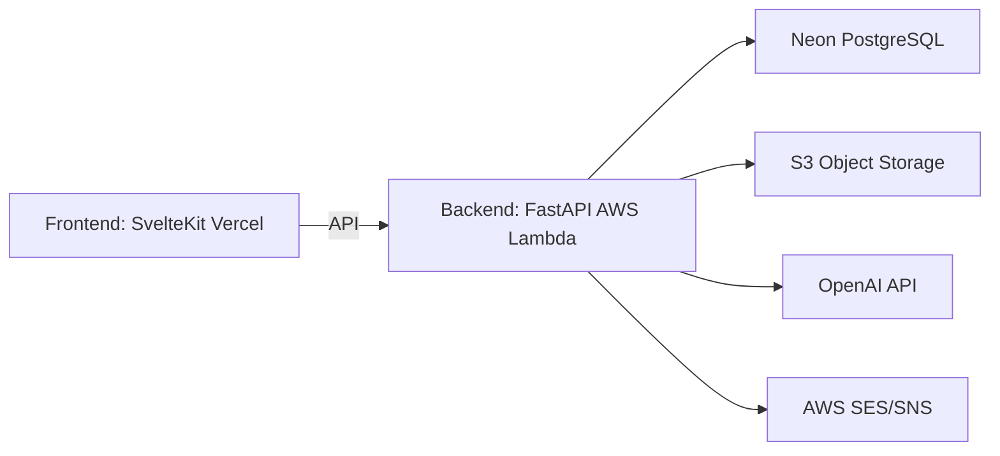
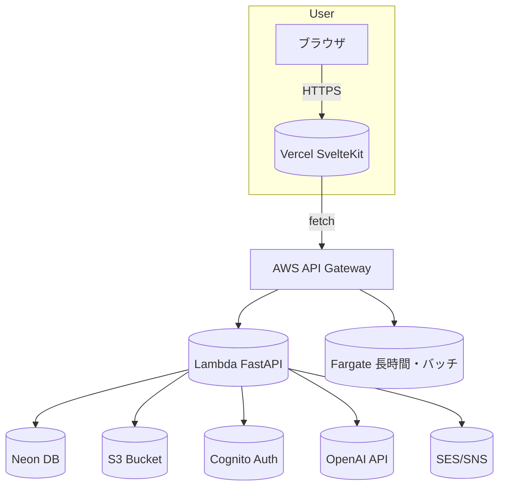

# 📘 Sister モダン化提案資料

## 1. 背景
既存の「Sister」システムは、2023年にExcelで行っていた業務管理をWebシステム化したものです。  
数年間の運用を経て安定稼働しているものの、以下の課題が顕在化しています：

- 機能追加時の保守コストが高い
- サーバ構成が固定的で、スケーラビリティが低い
- ログ・監視が限定的で、トラブルシュートに時間を要する
- UI/UX が時代にそぐわない
- 業務実態（運用・保守・突発対応）とデータ構造（プロジェクト中心）の乖離

これらを踏まえ、**サーバレス構成による低コスト・高拡張性・自動化された運用基盤**を実現することを目的に、
「**Sister 2**」として再構築を提案します。

---

## 2. 目的
- 運用・保守コストの最小化  
- セキュリティと可用性の向上  
- モダンなUI/UXによる利用者満足度向上  
- 将来的なAI連携・自動化への拡張性確保

本提案は、管理のためのシステム刷新ではなく、SIの担当者が「今日やるべき仕事を迷わず把握できる」ことを最優先に設計する。
主な利用者はSIの担当者とし、現場・管理者は参照と承認に必要な範囲で利用する想定とする。

---

## 3. 現行課題と影響

現行の Sister システムでは、以下の機能を中心に運用を行っている。

| 大分類 | 機能 | 説明 | 課題 |
|--------|------|------|------|
| Work管理 | 一覧・登録・削除 | 進捗・担当者・日付を管理 | 業務の性質/対象の表現が弱い |
| ナレッジ管理 | ブログ／ドラフト管理 | 記事投稿・タグ付け | 実装途中で停止 |
| 通知機能 | SES/SNS送信 | Work更新通知 | 通知が見づらい |
| ファイル管理 | S3アップロード | 署名付きURL発行 | 本格的な活用なし |
| 分析機能 | 進捗・稼働可視化 | グラフ表示 | 実装途中で停止 |
| 認証・認可 | 俺俺認証 / RBAC | 権限管理 | セキュリティ懸念 |

※ 一部機能（ナレッジ管理・分析機能）は構想段階で止まっており、現行アーキテクチャでは拡張コストが高い。

---

## 4. 提案コンセプト（全体像）

---

## 5. Sister 2 における機能再定義（拡張案）

### 既存機能の再設計
- **Work中心モデル**の採用（開発・運用・保守・突発対応を同一のWorkとして扱う）
- Work対象（プロジェクト/システム/共通業務）の分離
- 認証・認可を AWS Cognito に統一
- 通知・ファイル管理の非同期化・自動化

### 新規追加機能
- **チャット機能**
  - Work単位での会話
  - 必要に応じて対象単位（プロジェクト/システム）のスレッドを持つ
  - 初期段階では HTTP ベースの擬似リアルタイム方式
  - 将来的に利用状況に応じて SSE / WebSocket への移行を検討

- **社内ツール機能**
  - 定期作業・雑務（Excel管理業務）のシステム化
  - フォーム＋ワークフロー形式で柔軟に追加可能
  - 機能は個別実装を行わず、フォーム・ワークフロー・集計の3タイプに抽象化
  - 定義駆動型プラットフォームとして構築

- **管理業務機能**
  - マスタ管理（ユーザー/ロール/リソース/Work分類 等）
  - 初期導入時は必要最小限に留め、運用状況に応じて段階的に拡張する
  - システム設定管理（全体共通/組織単位）

### アイデア枠（低優先・将来構想）
- **人材育成支援（ゲーム的スキルツリーの可視化）**
  - ITSSのスキル体系をベースに、本人が理解しやすい「スキルツリー形式」で表現
  - Workの種類・頻度・深さを元に、成長の偏りや不足領域を可視化
  - 評価ではなく「自律的なキャリア形成の判断材料」として提供
  - 初期は最小構成（1職種・1ツリー）から検討
  - サンプル案: ITサービスマネジメント（運用・保守）ツリー
    - 定型対応（手順書対応/定期作業/エスカレーション）
    - インシデント対応（一次切り分け/影響範囲把握/暫定対応）
    - 原因分析（ログ調査/再現確認/恒久対応案）
    - 改善・設計（再発防止/手順改善/自動化提案）
  - サンプル案: アプリケーション開発ツリー
    - 実装基礎（コーディング/単体テスト/改修対応）
    - 設計・仕様（要件理解/影響範囲把握/基本設計）
    - 品質改善（レビュー/不具合解析/改善提案）
  - サンプル案: 変更管理・リリース管理ツリー
    - 計画・調整（リリース計画/関係者調整/影響評価）
    - 実行・監視（手順策定/リリース実行/監視・切り戻し）
    - 定着化（事後レビュー/標準化/自動化）
  - [Open Question] スキルツリーの最小構成（最初の10項目）をどの職種で定義するか
  - [Open Question] 成長が停滞している場合のUI表現（グレーアウト/🔒/注意文など）のトーン
  - [Open Question] 上司や組織に見せる範囲（本人のみ/傾向のみ/集計のみ）
  - [Open Question] Workのどの情報をスキル進行に反映するか（種類/頻度/成果/難易度）
  - [Open Question] 「成長不足の可視化」が心理的安全性に与える影響と緩和策

### AI連携の位置付け

Sister 2 における AI 機能は、単独の業務機能としてではなく、
既存機能および新規機能を横断的に補助する基盤機能として位置付ける。

- Work・チャット・社内ツールに蓄積される情報を対象に、要約・補完・提案を行う
- 定義駆動型の社内ツールに対し、入力補助・内容チェック・自動要約を提供
- 人が行う判断・承認を置き換えるのではなく、作業負荷の軽減および意思決定支援を目的とする
- 初期段階ではバッチ処理・オンデマンド実行を中心とし、利用状況に応じてリアルタイム連携を検討する

---

### 初期リリースで重視する価値体験

- **Workの可視化**を最優先とする（「今やるべき仕事が一目で分かる」状態の実現）

### 初期運用ルール（最小）

- Workの必須入力は「タイトル/担当/期限/ステータス/進捗コメント」
- 週次で進捗コメントの更新を必須化（毎週金曜 17:00 まで）
- 更新がない場合は当日18:00に自動リマインドを送信
- 運用ルールの監視・是正はリーダーが担当
- 通知は重要イベントに限定（期限アラート/担当変更/差し戻し）
- 期限アラートは「7日前・前日・当日」の3段階のみ送信

---

## 6. アーキテクチャ概要（採用技術と理由）

| 項目 | 採用技術 | 理由 |
|------|-----------|------|
| フロントエンド | **SvelteKit + TypeScript** | 軽量で反応性の高いUI構築が可能 |
| ホスティング | **Vercel** | デプロイ自動化・CD対応・無料枠で運用可能 |
| バックエンド | **FastAPI on AWS Lambda / Fargate** | Lambda：即時応答API／Fargate：長時間・バッチ処理 |
| データベース | **Neon (PostgreSQL)** | Serverless DB、スケーリングと高速性を両立 |
| ストレージ | **AWS S3** | ファイル・成果物の保管に最適 |
| 認証 | **AWS Cognito** | ユーザー管理とOAuth連携を統一化 |
| 通知 | **AWS SES/SNS** | メール通知・Push配信を簡易実装 |
| AI連携 | **OpenAI API** | 提案・要約・アシスタント機能を強化 |

※ Lambda は「画面操作に即時反応する処理」、Fargate は「時間のかかる集計・AI処理」を担当します。

### セキュリティ方針（API Gateway周辺）

- 認証/認可はCognito Authorizer（JWT）を基本とする
- 初期はレート制限とログ監視を必須とする
- WAFはコストとトラフィックを見て必要時に追加する（最小ルールセットから）

### 想定構成図

【処理の役割分担】  
・Lambda：画面操作やAPI呼び出しなど、即時レスポンスが必要な処理  
・Fargate：レポート生成、AI処理、バッチ処理など時間のかかる処理

---

## 7. 期待効果

### 特徴

- **完全サーバレス構成**で自動スケーリング  
- **CI/CD自動化**（GitHub Actions + Vercel / Lambda）  
- **S3署名URL + SES/SNS通知**によるファイル管理・通知機能  
- **AI連携による補助**で作業効率化（Work要約・レポート生成）※  
- **低コスト運用**（月額数百円レベルを目指す）  

>※ AI連携による業務工数削減  
>週次・月次レポートをAIが自動生成し、報告作成時間を約50〜70%削減（対象業務を限定し、PoCで効果を検証）  
>Work履歴・コメントを自動要約し、進捗確認・引き継ぎ工数を最小化（評価結果に応じて適用範囲を調整）

### 期待効果

- 開発・運用コストを約50%以上削減  
- デプロイ自動化によりメンテナンス時間を短縮  
- セキュリティ・スケーラビリティの強化  
- 将来的なAI・自動分析機能拡張が容易  

---

## 8. 移行方針

| 区分 | 方針 |
|------|------|
| データ | 現行PostgreSQL → Neonへの移行（スキーマ共通化） |
| コード | API層を段階的にFastAPIへ置換 |
| インフラ | Docker → サーバレス（Lambda/Fargate） |
| UI | 現行SvelteKit構成を踏襲しつつ再設計 |
| テスト | 機能単位でMSTest → pytest + Playwrightへ移行 |
| 認証 | Go LiveでCognitoへ一括切り替え（既存ユーザー移行を含む） |

---

## 9. コスト見積り（概算）

| サービス | 月額 | 備考 |
|-----------|-------|------|
| Vercel | 無料〜$20 | Hobbyプラン内運用可能 |
| AWS Lambda | 数ドル | 実行リクエストベース課金 |
| AWS Fargate | $10〜30 | 定期バッチ用に少量利用 |
| Neon | 無料〜$20 | Free Tier可 |
| S3 | 数ドル | ストレージ転送量次第 |
| SES/SNS | 数ドル | メール・通知コスト |
| 合計目安 | **$20〜50/月** | サーバレス構成による低コスト運用 |

---

## 10. スケジュール（想定）

| フェーズ | 期間 | 内容 |
|-----------|------|------|
| 1. 要件定義 | 4週間 | 機能・構成の整理 |
| 2. PoC開発 | 12週間 | Lambda・Vercel・Neonの連携確認 |
| 3. 実装 | 16〜20週間 | フロント・バックエンド構築 |
| 4. テスト・検証 | 6週間 | 結合／負荷／運用テスト |
| 5. リリース | - | 本番運用開始 |

※ PoCフェーズ終了時点で、Work中心モデルの有効性および実業務での利用可否を評価し、以降の実装範囲を調整する。

---

## 11. 今後の展開案

- AIによるWork要約・レポート生成  
- ユーザー別の作業傾向分析・KPI可視化  
- モバイル対応・通知機能強化  
